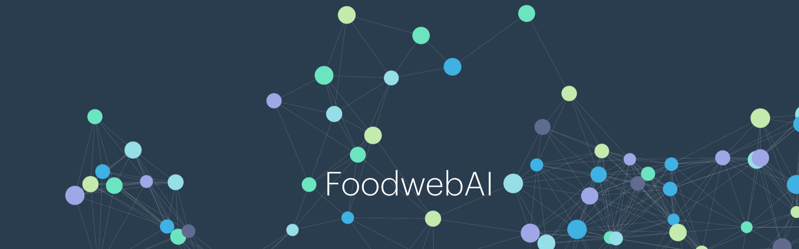

# 

FoodWebAI is a user-friendly web application designed to fill gaps in species records with additional metadata and create food webs using only taxa lists. By combining limited ecological knowledge with AI capabilities, FoodWebAI offers an innovative solution to the complexities of food web creation.

Food webs depict the intricate connections between organisms in ecosystems, vital for understanding energy and material transfers. Creating precise food webs is challenging due to the complexity of ecological systems and the need for extensive data. Recent advancements in artificial intelligence (AI), notably in Natural Language Processing (NLP), are revolutionizing data handling, particularly with the availability of large datasets containing nodes (i.e., species) within food webs.

### Key Features

-   **Creating entire new Food Webs from a list of species**: The application can recreate food webs from taxa lists, verifying accuracy by comparing the results to known or accepted values.
-   **Augmenting pre defined Food Webs with metadata**: FoodWebAI utilizes OpenAI’s GPT-3.5-Turbo model via the rpgt3 package in R to complement species lists with additional properties, such as species type (e.g., fish, bird, invertebrate, mammal, primary producer, and detritus), species behavior, habitat, International Union for Conservation of Nature (IUCN) conservation status and others

### Performance

-   **High Accuracy for initial test with for Arctic Ecosystems**: FoodWebAI achieves impressive accuracy rates for the Arctic ecosystem, both in augmenting species lists (95-100% accuracy) and in creating new food webs (100% accuracy in determining trophic levels and 79% accuracy in predicting trophic links).
-   **Challenges in Larger Ecosystems**: In ecosystems with a larger number of taxa, such as the Chesapeake Bay and the Amazon River basin, FoodWebAI provides lower accuracy rates for augmenting species by conservation status. While predicting trophic levels shows good results, predicting trophic links is less accurate.

### Experimental but Promising

Although FoodWebAI is still experimental, it offers a powerful complementary methodology for food web ecology. By merging food web ecology with AI, FoodWebAI enhances access to global data and deepens our understanding of complex network systems.

## Conclusion

Explore FoodWebAI today and discover how AI can transform our understanding of ecological networks and support informed decision-making in conservation and environmental management.
